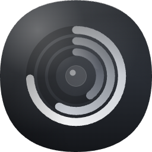

<p align="center">
  
</p>

<h1 align="center">MacStats</h1>

<p align="center">Open-source hardware monitoring for macOS. Lives in the menu bar.</p>

<p align="center">
  
  
  
</p>

---

## Why

The macOS Activity Monitor is heavy and hidden in `/Applications/Utilities`. iStat Menus is excellent but paid. MacStats aims for the narrow middle: a menu-bar-first system monitor that shows CPU, RAM, disk, network, battery, and top processes at a glance — and stays out of your way.

## Features

- **Menu bar at-a-glance** — CPU %, memory used (GB), and disk I/O rate, each with its own icon. Pick any combination; the bar auto-sizes.
- **Dropdown detail** — live readouts for CPU (user / system / idle + sparkline), memory pressure, network up/down, disk R/W, battery state, and a tabbed list of top processes by CPU / RAM / Disk.
- **Per-process insight** — top 8 apps by any metric, updated every 2 s via `libproc`.
- **Stable UI** — fixed-width metric slots, Apple system menu font, frozen layout while the dropdown is open (no jitter when toggling).
- **Native** — Swift + SwiftUI + AppKit. No Electron, no Python, no daemons. Idles around 70 MB RAM, < 1% CPU.
- **Zero config** — no accounts, no telemetry, no network calls.

## Screenshot

_(Capture the menu bar with CPU + RAM + Disk selected, and the open dropdown, and drop PNGs here.)_

## Requirements

- macOS 13 (Ventura) or later
- Apple Silicon (arm64) — an Intel build is possible but not yet produced

## Install

### Prebuilt

Grab the latest `.app` from [Releases](../../releases), unzip, and move to `/Applications`.

Because the build is not signed with an Apple Developer ID yet, Gatekeeper will refuse it on first launch. Workaround:

- Right-click `MacStats.app` → **Open** → **Open** in the dialog, **or**
- System Settings → Privacy & Security → scroll to "MacStats was blocked" → **Open Anyway**.

### Build from source

```bash
git clone https://github.com/<you>/mac-stats.git
cd mac-stats
./Scripts/run.sh            # debug build + launch
./Scripts/bundle.sh release # production .app in .build/.../MacStats.app
```

Requirements: Xcode 15+ or the Swift 6.3 toolchain. No package dependencies.

## Usage

1. Launch the app — the status item appears in the menu bar.
2. Click the icon to open the dropdown.
3. At the bottom of the dropdown, toggle **CPU / RAM / Disk** to pick which metrics show in the menu bar. Selection persists across restarts.
4. **Quit** from the dropdown or press `⌘Q` with it focused.

No settings window; by design.

## Data sources

| Domain | API |
|---|---|
| CPU load | `host_statistics` with `HOST_CPU_LOAD_INFO` |
| Memory | `host_statistics64` with `HOST_VM_INFO64` |
| Network I/O | `getifaddrs` + `if_data` |
| Disk I/O | IOKit `IOBlockStorageDriver` statistics |
| Volumes | `URL.resourceValues(forKeys:)` |
| Battery | `IOPowerSources` |
| Per-process | `libproc` (`proc_listpids`, `proc_pidinfo`, `proc_pid_rusage`) |

All public APIs. No SIP bypass, no kexts, no private entitlements.

## Limitations

- **No per-process network metrics.** `nettop` needs root or a `NetworkExtension` entitlement. Out of scope for now.
- **No temperatures or fan speeds.** SMC keys are private API. Not planned unless strictly needed.
- **Not yet signed / notarized.** Installation requires a Gatekeeper override (see above).
- **Apple Silicon only** in current releases.

## Roadmap

- [ ] Apple Developer ID signing + notarization for frictionless install
- [ ] Universal binary (arm64 + x86_64)
- [ ] Launch at login (`SMAppService`)
- [ ] Auto-update via Sparkle
- [ ] Optional per-process network (nettop shell-out, opt-in)
- [ ] Temperature sensors (SMC) — under evaluation

## Project layout

```
Sources/MacStats/
├── MacStatsApp.swift          # @main, AppDelegate
├── StatusBarController.swift  # NSStatusItem + popover
├── SystemStats.swift          # tick loop, aggregate monitors
├── DisplayPreferences.swift   # which metrics show in the bar
├── MenuBarSnapshot.swift      # frozen prefs for the status item
├── Formatters.swift
├── Monitors/                  # one sampler per hardware domain
└── Views/                     # SwiftUI label + dropdown content
```

See [`CLAUDE.md`](./CLAUDE.md) for architecture notes, tricky Darwin API shapes, and guidance for AI agents working on the codebase.

## Contributing

Issues and PRs welcome. Keep it simple: this is meant to stay small.

Before opening a PR:
- `swift build -c release` passes
- `./Scripts/run.sh` launches cleanly and the menu bar behaves

No tests yet; manual verification is the bar.

## Credits

- Icon design: `design_handoff_macstats_logo/` — hand-authored SVG, Apple-style squircle with Liquid Glass material and three activity rings.
- Inspiration: [iStat Menus](https://bjango.com/mac/istatmenus/).

## License

MIT. See [LICENSE](./LICENSE).
