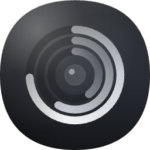

<p align="center">
  
</p>

<h1 align="center">MacStats</h1>

<p align="center">Open-source system monitor for macOS. Lives in the menu bar.</p>

<p align="center">
  
  
  
</p>

---

## Why

Activity Monitor is heavy and buried in `/Applications/Utilities`; iStat Menus is great but paid. MacStats sits in the middle: CPU, RAM, disk, network, battery and the top processes at a glance, straight from the menu bar.

## What it does

- **Menu bar** — pick any of CPU %, temperature, RAM, disk I/O and network rate. Each one is its own status item, so macOS hides them one by one when the bar gets crowded.
- **Dropdown** — live readouts per domain plus the top processes by CPU / RAM / Disk / Network / Energy. Clicking an icon opens the list already on that metric's tab.
- **Main window** — Overview, CPU, GPU, Memory, Disk, Network, Battery, Temperature, Fans and a filterable process table, each chart with a `1m / 1h / 24h` switcher.
- **Cheap when idle** — the expensive probes (process list, battery, volume capacity, temperature, GPU, fans, Wi-Fi, `nettop`) only run while some view needs them. Idle sits around 76 MB and ~0.5 % CPU.
- **Native and offline** — Swift 6 + SwiftUI + AppKit, no dependencies, no accounts, no telemetry. The only outbound call is the public-IP lookup in the Wi-Fi pane.

## Install

Download the `.dmg` from [Releases](../../releases) and drag MacStats to `/Applications`.

The build isn't signed with an Apple Developer ID, so Gatekeeper blocks the first launch. Right-click the app → **Open** → **Open**, or allow it in System Settings → Privacy & Security.

Requires macOS 13+ on Apple Silicon.

## Build from source

```bash
./Scripts/run.sh             # debug build + launch
./Scripts/bundle.sh release  # production .app under .build/
```

Needs the Swift 6.3 toolchain (Xcode 15+). No package dependencies.

## Usage

Click any menu bar item to open the dropdown. The checkboxes at the bottom choose which metrics show in the bar (persisted across restarts). The window icon in the header opens the main window; `⌘Q` quits. There's no settings window, on purpose.

## Limitations

- No SMC voltage / current sensors — the keys vary per chip family. Fan RPM does work.
- Wi-Fi SSID needs Location permission on macOS 13+; without it the pane shows "Connected" but no name.
- Not signed or notarized yet, hence the Gatekeeper override above.
- Apple Silicon only. On Intel the temperature, GPU and fan panes hide themselves.

## Contributing

Issues and PRs welcome, but this is meant to stay small. Before opening one: `swift build -c release` passes and `./Scripts/run.sh` launches cleanly. No tests, manual verification is the bar.

Architecture notes, the sampling design and the tricky Darwin APIs live in [`CLAUDE.md`](./CLAUDE.md) (mirrored at [`AGENTS.md`](./AGENTS.md)).

## Credits

Icon hand-authored in `design_handoff_macstats_logo/`. Inspired by [iStat Menus](https://bjango.com/mac/istatmenus/).

## License

MIT. See [LICENSE](./LICENSE).
